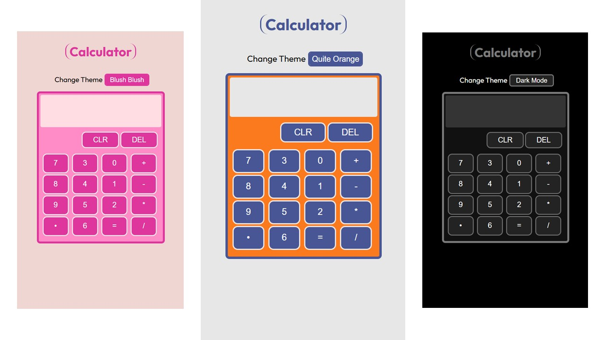

# Calculator

### A calculator project which can solve fundamental math operations(add,subtract,divide & multiply)

[Live Demo](https://alam-afroz.github.io/Calculator/)
**The Calculator** :

- You can do addition, subtraction, multiplication and division
- Decimal numbers calculation done

**The Code**

- The main learning is to manage states using variables.
- Fonts by google fonts.
